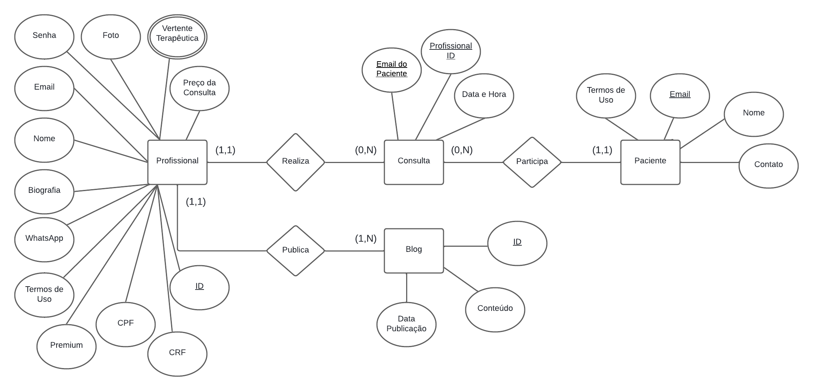
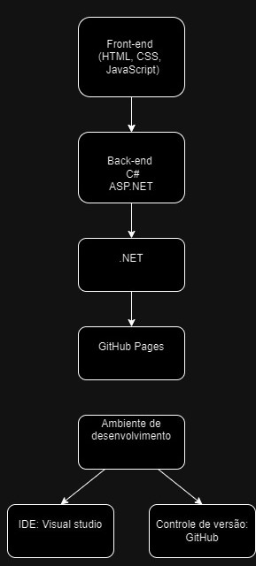

# Arquitetura da Solução

Pré-requisitos: <a href="3-Projeto de Interface.md"> Projeto de Interface</a>

Definição de como o software é estruturado em termos dos componentes que fazem parte da solução e do ambiente de hospedagem da aplicação.

## Diagrama de Classes

- O  psicologo pode se cadastrar no sistema com apenas nome, cpf, email e senha. Em seguida recebe um link por email para completar um perfil que corresponda aos seus interesses e direção profissional.
- O profissional poderá clicar o botão de recuperar senha e inserir seu email e após confirmar receberá do sistema um link para redefinir senha.
- A entrada no sistema se dará por meio de email e senha de cadastro (login).
- Ao entrar no sistema o usuário tem como página principal o seu perfil preenchido podendo editar todos os campos necessários.
- O profissional pode cadastrar, editar ou excluir os textos de sua autoria dentro do Blog.
- O profissional pode optar por efetuar o pagamento via pix para se destarcar nas pesquisas dos potenciais clientes.
- O profissional receberá um email de aviso de uma nova consulta agendada.
- O profissional pode editar as datas de calendário disponíveis para atendimento.
- O profissional terá acesso a uma lista atualizada e de fácil visualização das suas consultas agendadas.
- O profissional pode ter acesso a cancelar uma consulta se necessário.
- O profissional receberá lembrete no email 30 min antes da consulta agendada.
- O paciente tem acesso a página inicial do site sem necessidade de login.
- O paciente poderá bsucar por profissionais.
- O paciente poderá realizar pesquisas de acordo com critérios específicos.
- O paciente poderá escolher pelo site uma data disponípivel no calendario do profissional.
- O paciente deverá aceitar os termos e condições do contrato de utilização da plataforma.
- O paciente poderá entrar em contato diretamente com o profissional por meio do whatsapp após confirmar uma data de consulta para tirar eventuais dúvidas.
- O paciente receberá um email de confirmação da consulta agendada.
- O paciente receberá lembrete no email 2h antes da consulta.
- O paciente poderá ter acesso as dúvidas mais frequentes (FAQ).
> - [Diagramas de Classes - Documentação da IBM](https://www.ibm.com/docs/pt-br/rational-soft-arch/9.6.1?topic=diagrams-class)
> - [O que é um diagrama de classe UML? | Lucidchart](https://www.lucidchart.com/pages/pt/o-que-e-diagrama-de-classe-uml)

## Modelo ER (Projeto Conceitual)

## Projeto da Base de Dados
Projeto da Base de Dados levando em conta o Diagrama de Classes e o Modelo Entidade Relacionamento (MER), detalhando os tipos de dados de cada tabela, as chaves primárias e estrangeiras e as cardinalidades entre os relacionamentos.

## Tecnologias Utilizadas
### Linguagens:
Para o desenvolvimento do projeto PsiConexão, utilizamos as seguintes linguagens:
- **HTML**: para a estrutura do front-end.
- **CSS**: para o design e estilização da interface.
- **JavaScript**: para a criação de interações dinâmicas no front-end.
- **C#**: para o desenvolvimento do back-end, garantindo a lógica de negócio e a manipulação dos dados.
### Serviços Web:
O site está hospedado via **GitHub Pages**, uma solução gratuita e eficaz para hospedar sites estáticos diretamente a partir de um repositório GitHub.
### Frameworks:
- **ASP.NET**: foi escolhido como framework para o desenvolvimento de aplicações web dinâmicas, permitindo a criação de um ambiente robusto e escalável.
### Bibliotecas:
- **.NET**: plataforma escolhida para a base do projeto, oferecendo suporte a múltiplas tecnologias e garantindo a performance necessária.
### IDEs de Desenvolvimento:
O **Visual Studio** foi a ferramenta de desenvolvimento escolhida devido à sua integração completa com o GitHub, facilitando o desenvolvimento e o controle de versão.
### Ferramentas:
Para o controle de versão e colaboração, utilizamos o **GitHub**, o que garante um fluxo de trabalho eficiente e seguro entre os membros da equipe de desenvolvimento.

## Hospedagem

Explique como a hospedagem e o lançamento da plataforma foi feita.

> **Links Úteis**:
>
> - [Website com GitHub Pages](https://pages.github.com/)
> - [Programação colaborativa com Repl.it](https://repl.it/)
> - [Getting Started with Heroku](https://devcenter.heroku.com/start)
> - [Publicando Seu Site No Heroku](http://pythonclub.com.br/publicando-seu-hello-world-no-heroku.html)
